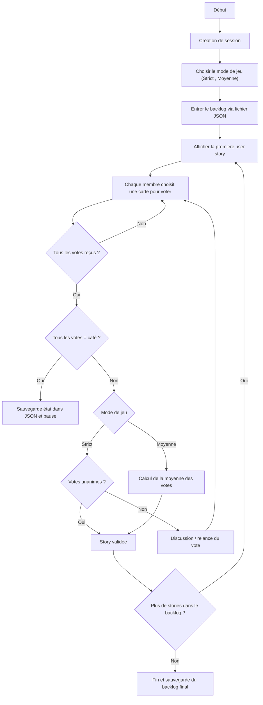

```mermaid
flowchart TD
    A["Début"] --> B["Création de session"]
    B --> C["Choisir le mode de jeu (Strict , Moyenne)"]
    C --> D["Entrer le backlog via fichier JSON"]
    D --> E["Afficher la première user story"]
    E --> F["Chaque membre choisit une carte pour voter"]
    F --> G{Tous les votes reçus ?}
    G -- Non --> F
    G -- Oui --> H{Tous les votes = café ?}
    H -- Oui --> I["Sauvegarde état dans JSON et pause"]
    H -- Non --> J{Mode de jeu}
    J -- Strict --> K{Votes unanimes ?}
    K -- Oui --> L["Story validée"]
    K -- Non --> M["Discussion / relance du vote"]
    M --> F
    J -- Moyenne --> N["Calcul de la moyenne des votes"]
    N --> L
    L --> O{Plus de stories dans le backlog ?}
    O -- Oui --> E
    O -- Non --> P["Fin et sauvegarde du backlog final"]
```
