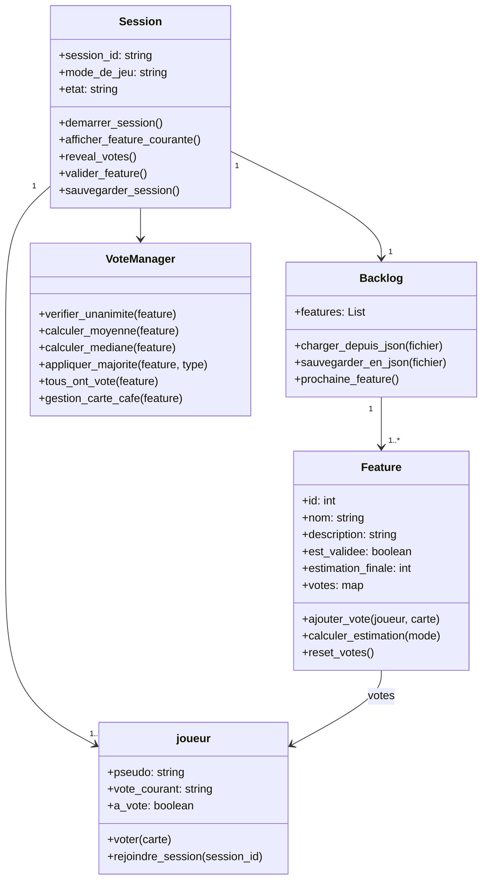

```mermaid
classDiagram
    class Session{
        +session_id: string
        +mode_de_jeu: string
        +etat: string
        +demarrer_session()
        +afficher_feature_courante()
        +reveal_votes()
        +valider_feature()
        +sauvegarder_session()
    }

    class joueur{
        +pseudo: string
        +vote_courant: string
        +a_vote: boolean
        +voter(carte)
        +rejoindre_session(session_id)
    }

    class Feature{
        +id: int
        +nom: string
        +description: string
        +est_validee: boolean
        +estimation_finale: int
        +votes: map
        +ajouter_vote(joueur, carte)
        +calculer_estimation(mode)
        +reset_votes()
    }

    class Backlog{
        +features: List
        +charger_depuis_json(fichier)
        +sauvegarder_en_json(fichier)
        +prochaine_feature()
    }

    class VoteManager{
        +verifier_unanimite(feature)
        +calculer_moyenne(feature)
        +calculer_mediane(feature)
        +appliquer_majorite(feature, type)
        +tous_ont_vote(feature)
        +gestion_carte_cafe(feature)
    }

    Session "1" --> "1..*" joueur
    Session "1" --> "1" Backlog
    Backlog "1" --> "1..*" Feature
    Feature --> joueur : votes
    Session --> VoteManager
```
